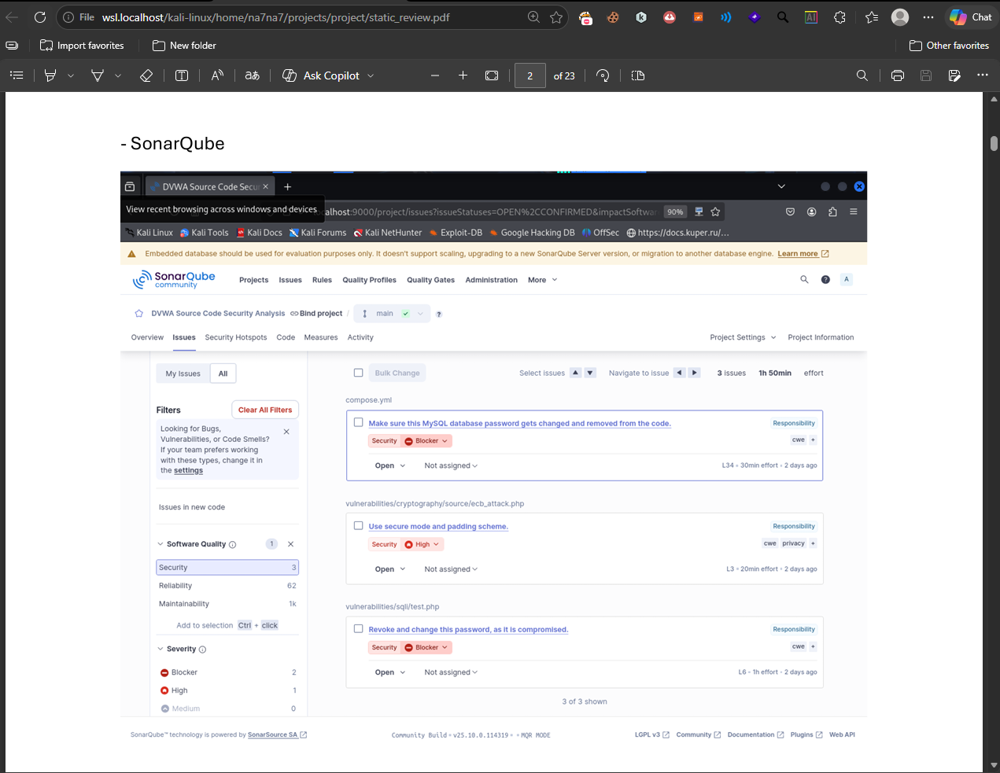
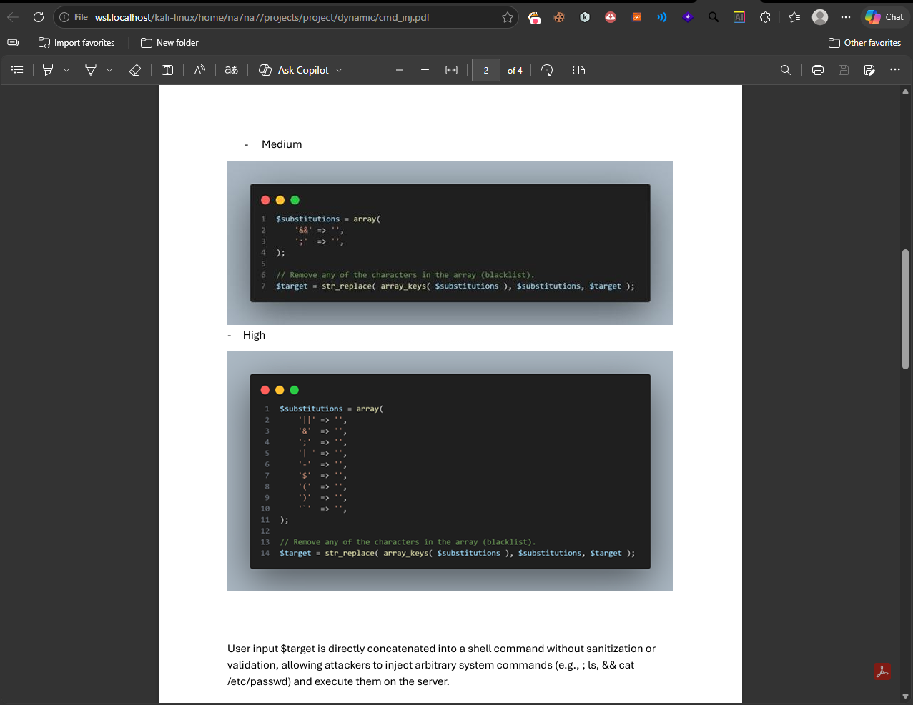

<div align="center">

<br/>

```
███████╗██████╗  ██████╗ ████████╗ ██████╗██╗  ██╗██╗   ██╗
██╔════╝██╔══██╗██╔═══██╗╚══██╔══╝██╔════╝██║  ██║╚██╗ ██╔╝
███████╗██████╔╝██║   ██║   ██║   ██║     ███████║ ╚████╔╝ 
╚════██║██╔═══╝ ██║   ██║   ██║   ██║     ██╔══██║  ╚██╔╝  
███████║██║     ╚██████╔╝   ██║   ╚██████╗██║  ██║   ██║   
╚══════╝╚═╝      ╚═════╝    ╚═╝    ╚═════╝╚═╝  ╚═╝   ╚═╝   
```

**Security Penetration Testing & Code Review — DVWA**


</div>

---

## 📌 Overview

**SPOTCHY** is a collaborative security research project focused on identifying, analyzing, and documenting vulnerabilities in **DVWA (Damn Vulnerable Web Application)**. The project combines manual source code review with dynamic testing to produce detailed, reproducible vulnerability reports across the OWASP Top 10 and beyond.

> This project was conducted as part of a structured security research workflow, with each team member owning specific vulnerability domains from discovery through documentation.

---

## 🎯 Scope & Methodology

The project follows a structured **Secure SDLC** approach:

| Phase | Description |
|-------|-------------|
| **Reconnaissance** | Understanding DVWA's architecture and attack surface |
| **Static Analysis** | Manual PHP source code review to identify vulnerable patterns |
| **Dynamic Testing** | Live exploitation and payload crafting against running DVWA instances |
| **Documentation** | Structured findings reports per vulnerability category |
| **Policy Review** | Secure SDLC policy drafting based on findings |

---

## 🔍 Vulnerabilities Covered

<table>
<tr>
<td>

**Injection**
- ✅ SQL Injection (Classic)
- ✅ Blind SQL Injection
- ✅ Command Injection
- ✅ Local File Inclusion (LFI)

</td>
<td>

**Client-Side**
- ✅ Reflected XSS
- ✅ Stored XSS
- ✅ DOM-Based XSS
- ✅ CSRF

</td>
<td>

**Access & Auth**
- ✅ Authentication Bypass
- ✅ Brute Force Attacks
- ✅ Broken Session / Weak ID
- ✅ Open Redirect

</td>
<td>

**Miscellaneous**
- ✅ File Upload Vulnerabilities
- ✅ JavaScript Security Issues
- ✅ Content Security Policy (CSP) Analysis
- ✅ Apache Misconfigurations
- ✅ API Security Testing

</td>
</tr>
</table>

---

## 📸 Sample Findings

### Static Code Review


### Code Review


## 📁 Repository Structure

```
SPOTCHY/
│
├── 📂 DVWA-Source/          # Original DVWA codebase (READ-ONLY reference)
│
├── 📂 Findings/             # Vulnerability reports per category
│   ├── sqli.pdf             # SQL Injection
│   ├── blind_sqli.pdf       # Blind SQL Injection
│   ├── cmd_inj.pdf          # Command Injection
│   ├── lfi.pdf              # Local File Inclusion
│   ├── reflected_xss.pdf    # Reflected Cross-Site Scripting
│   ├── stored_xss.pdf       # Stored Cross-Site Scripting
│   ├── Dom_xss.pdf          # DOM-Based XSS
│   ├── csrf.pdf             # Cross-Site Request Forgery
│   ├── auth-bypass.pdf      # Authentication Bypass
│   ├── brute_force.pdf      # Brute Force
│   ├── week_id.pdf          # Weak Session IDs
│   ├── file_upload.pdf      # Insecure File Upload
│   ├── open_redirect.pdf    # Open Redirect
│   ├── csp.pdf              # CSP Misconfiguration
│   ├── capache.pdf          # Apache Configuration Issues
│   ├── js.pdf               # JavaScript Vulnerabilities
│   ├── api.pdf              # API Security
│   └── static_review.pdf    # Full Static Code Review
│
├── 📂 Documentation/        # Team guides, setup notes, workflow
│
└── 📄 README.md
```

---

## 📄 Key Deliverables

| Deliverable | Description |
|---|---|
| **Static Code Review** | Full manual review of DVWA PHP source identifying insecure patterns |
| **18 Vulnerability Reports** | Individual PDF reports with payloads, screenshots, and remediation |
| **Secure SDLC Policy Draft** | A policy document outlining secure development practices informed by findings |

---

## ⚙️ Team Workflow

```bash
# 1. Clone the repository
git clone https://github.com/noohzidan/SPOTCHY.git

# 2. Create your personal branch
git checkout -b yourname-branch

# 3. Add your findings to the Findings/ folder

# 4. Commit and push
git add .
git commit -m "Add: [vulnerability-name] findings report"
git push origin yourname-branch

# 5. Open a Pull Request to merge into main
```

Each team member owns a set of vulnerability categories end-to-end — from identifying the vulnerable code pattern, crafting working exploits, to writing the final report.

---

## 👥 Team

| Researcher | Profile |
|---|---|
| **nooh zidan** | [@noohzidan](https://github.com/noohzidan) |
| **Solst1ce** | [@Solst1ce0x](https://github.com/Solst1ce0x) |

---

## ⚠️ Disclaimer

> This project is strictly for **educational purposes**. All testing was conducted in a **controlled, isolated lab environment** against DVWA — a deliberately vulnerable application designed for security training. No real systems were targeted. The findings and techniques documented here must not be applied to any system without explicit written authorization.

---

<div align="center">

**SPOTCHY** · Security Research · DVWA · OWASP Top 10

</div>
